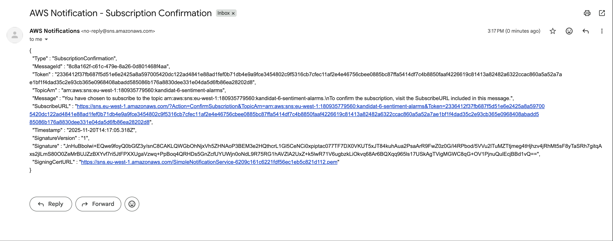

# PGR301 Eksamen 2025 - Besvarelse

**Kandidatnummer:** 6

---

## Oppgave 1 - Terraform, S3 og Infrastruktur som Kode (15 poeng)

### Leveranser

#### Terraform-kode
- **Mappe:** [infra-s3/](infra-s3/)
- **Hovedfiler:**
  - [main.tf](infra-s3/main.tf) - S3 bucket og lifecycle konfiguration
  - [variables.tf](infra-s3/variables.tf) - Variable definisjoner
  - [outputs.tf](infra-s3/outputs.tf) - Output verdier
  - [README.md](infra-s3/README.md) - Dokumentasjon

#### GitHub Actions Workflow
- **Workflow-fil:** [.github/workflows/terraform-s3.yml](.github/workflows/terraform-s3.yml)
- **Workflow kjøringer:**
  - Terraform Validate (PR validation): https://github.com/AlsosCode/PGR301-DevOps-Exam/actions/runs/19367523586/job/55414475019
  - Terraform Apply (Successful deployment): https://github.com/AlsosCode/PGR301-DevOps-Exam/actions/runs/19367523586/job/55414518426

#### S3 Bucket
- **Bucket navn:** `kandidat-6-data`
- **Region:** `eu-west-1`

### Implementasjonsdetaljer

#### Lifecycle Policy
Terraform-konfigurasjonen implementerer følgende lifecycle-strategi for filer under `midlertidig/` prefix:

1. **Transition til Glacier:** Filer flyttes til Glacier storage class etter 30 dager
2. **Sletting:** Filer slettes automatisk etter 90 dager
3. **Multipart upload cleanup:** Ufullstendige multipart uploads slettes etter 7 dager
4. **Versjon cleanup:** Gamle versjoner av filer slettes etter 90 dager

Filer utenfor `midlertidig/` prefikset lagres permanent uten lifecycle-regler.

#### Sikkerhet
- Server-side encryption (AES256) aktivert
- Versioning aktivert for å beskytte mot utilsiktet sletting
- Public access fullstendig blokkert

#### CI/CD Pipeline
GitHub Actions workflow kjører automatisk ved endringer i `infra-s3/` eller workflow-filen:

**På Pull Requests:**
- `terraform fmt -check` - Validerer formatering
- `terraform validate` - Validerer konfigurasjon
- `terraform plan` - Viser planlagte endringer
- Poster resultater som kommentar på PR

**På Push til Main:**
- Kjører samme valideringer
- `terraform apply -auto-approve` - Deployer infrastruktur
- Viser outputs i workflow summary

### Instruksjoner for bruk

1. **Kopier variabel-filen:**
   ```bash
   cd infra-s3
   cp terraform.tfvars.example terraform.tfvars
   ```

2. **Oppdater med ditt kandidatnummer:**
   ```hcl
   bucket_name = "kandidat-<DITT-NR>-data"
   ```

3. **Initialiser og deploy:**
   ```bash
   terraform init
   terraform plan
   terraform apply
   ```

4. **For GitHub Actions:**
   - Sett repository secrets: `AWS_ACCESS_KEY_ID` og `AWS_SECRET_ACCESS_KEY`
   - Push endringer til en branch og opprett PR for å se validering
   - Merge til main for å deploye infrastruktur

---

## Oppgave 2 - AWS Lambda, SAM og GitHub Actions (25 poeng)

### Del A (10p): Deploy og test SAM-applikasjonen

#### Leveranser

- **API Gateway URL:** https://8z9glu80ta.execute-api.eu-west-1.amazonaws.com/Prod/analyze/
- **S3 objekt:** Resultater lagres i `s3://kandidat-6-data/midlertidig/` med auto-cleanup etter 90 dager

#### Implementasjon

SAM-applikasjonen er konfigurert med:
- **S3 Bucket:** `kandidat-6-data` (oppdatert i template.yaml)
- **Stack Name:** `aialpha-sentiment-kandidat-6`
- **Runtime:** Python 3.11
- **Lambda Timeout:** 30 sekunder
- **Memory:** 256 MB

Applikasjonen bruker AWS Comprehend for sentimentanalyse og lagrer resultater under `midlertidig/` prefix i S3-bucketen, slik at lifecycle-policyen fra Oppgave 1 automatisk sletter dem etter 90 dager.

### Del B (15p): GitHub Actions Workflow

#### Leveranser

- **Workflow-fil:** [.github/workflows/sam-deploy.yml](.github/workflows/sam-deploy.yml)
- **Successful deploy:** https://github.com/AlsosCode/PGR301-DevOps-Exam/actions/runs/19367717255

#### Implementerte forbedringer

Den opprinnelige workflowen hadde flere problemer som er nå rettet:

**Problemer i original workflow:**
1. ❌ Deployet til AWS på **hver** pull request (ikke god DevOps-praksis)
2. ❌ Manglet `sam validate` og `sam build` steg
3. ❌ Hardkodet verdier (stack-navn, bucket-navn)

**Løsning:**

Workflowen er nå delt i to jobs:

**1. `validate-and-build` job** (kjører på både PR og push):
- ✅ Kjører `sam validate` for å verifisere template syntax
- ✅ Kjører `sam build` for å bygge applikasjonen
- ✅ Laster opp build artifacts for deployment-jobben

**2. `deploy` job** (kjører KUN på push til main):
- ✅ Betinget kjøring: `if: github.event_name == 'push' && github.ref == 'refs/heads/main'`
- ✅ Laster ned build artifacts
- ✅ Kjører `sam deploy` med riktig konfigurasjon
- ✅ Henter API Gateway URL fra CloudFormation outputs
- ✅ Tester deployed endepunkt automatisk

**Bruk av environment variabler:**
```yaml
env:
  AWS_REGION: eu-west-1
  STACK_NAME: aialpha-sentiment-kandidat-6
  S3_BUCKET: kandidat-6-data
```

Dette gjør workflowen enkel å tilpasse for andre kandidater ved å kun endre verdiene i `env`-seksjonen.

#### Instruksjoner til sensor

For å få workflowen til å kjøre i din fork:

1. **Legg til GitHub Secrets:**
   - Gå til Settings → Secrets and variables → Actions
   - Legg til `AWS_ACCESS_KEY_ID`
   - Legg til `AWS_SECRET_ACCESS_KEY`

2. **Oppdater environment variabler:**
   - Åpne `.github/workflows/sam-deploy.yml`
   - Endre `STACK_NAME` og `S3_BUCKET` til dine verdier i `env`-seksjonen

3. **Deploy Terraform infrastruktur først:**
   - Kjør Terraform workflow for å opprette S3 bucketen
   - SAM deployment vil feile uten eksisterende S3 bucket

4. **Trigger workflow:**
   - Push en endring til `sam-comprehend/` mappen
   - Eller manuelt trigger fra Actions-fanen

#### Testing

For å teste API-et lokalt:
```bash
curl -X POST <API-GATEWAY-URL> \
  -H "Content-Type: application/json" \
  -d '{"text": "Apple launches groundbreaking new AI features while Microsoft faces security concerns."}'
```

Workflowen tester også automatisk endepunktet etter deployment og viser resultatet i workflow-loggen.

---

## Oppgave 3 - Container og Docker (25 poeng)

### Del A (10p): Containeriser Spring Boot-applikasjonen

#### Leveranser

- **Dockerfile:** [sentiment-docker/Dockerfile](sentiment-docker/Dockerfile)
- **Docker Hub Repository:** https://hub.docker.com/r/alsoscode/sentiment-docker

#### Implementasjon

Dockerfilen bruker **multi-stage build** for optimal imagestørrelse og effektivitet:

**Build Stage (Maven + Java 21):**
```dockerfile
FROM maven:3.9-amazoncorretto-21 AS build
```
- Bruker Maven for å bygge applikasjonen
- Dependency caching for raskere rebuilds
- Kompilerer og pakker Spring Boot applikasjonen

**Runtime Stage (Corretto Alpine):**
```dockerfile
FROM amazoncorretto:21-alpine
```
- Minimal Alpine-basert runtime image
- Non-root user (`spring:spring`) for sikkerhet
- JVM container support aktivert
- Health check konfigurert
- Eksponerer port 8080

**Sikkerhetsfeatures:**
- ✅ Non-root user execution
- ✅ Minimal Alpine base image
- ✅ Health checks for container orchestration
- ✅ Environment-based secrets
- ✅ JVM tuned for containers

### Del B (15p): GitHub Actions workflow for Docker Hub

#### Leveranser

- **Workflow-fil:** [.github/workflows/docker-build.yml](.github/workflows/docker-build.yml)
- **Successful build:** https://github.com/AlsosCode/PGR301-DevOps-Exam/actions/workflows/docker-build.yml
- **Container image:** `alsoscode/sentiment-docker:latest`
- **Docker Hub Repository:** https://hub.docker.com/r/alsoscode/sentiment-docker

#### Tagging-strategi

**Multi-tag strategi** for fleksibilitet og sporbarhet:

1. **`latest`** - Alltid siste build fra main
2. **`kandidat-6`** - Kandidatspesifikk tag
3. **`kandidat-6-sha-<commit>`** - Commit-spesifikke tags for full traceability

**Hvorfor denne strategien?**
- `latest` gir alltid nyeste versjon
- `kandidat-6` gjør det enkelt for sensor
- SHA-tags gir full sporbarhet til eksakt commit

#### Instruksjoner til sensor

1. Opprett Docker Hub konto og access token
2. Legg til GitHub Secrets: `DOCKER_USERNAME` og `DOCKER_TOKEN`
3. Oppdater image navn i workflow
4. Push til `sentiment-docker/` for å trigge build

---

## Oppgave 4 - Observabilitet, Metrikksamling og Overvåkningsinfrastruktur (25 poeng)

### Del A (15p): Implementasjon av Custom Metrics

#### Leveranser

- **Kode:** [sentiment-docker/src/main/java/com/aialpha/sentiment/metrics/SentimentMetrics.java](sentiment-docker/src/main/java/com/aialpha/sentiment/metrics/SentimentMetrics.java)
- **Config:** [sentiment-docker/src/main/java/com/aialpha/sentiment/config/MetricsConfig.java](sentiment-docker/src/main/java/com/aialpha/sentiment/config/MetricsConfig.java)
- **CloudWatch Dashboard:** 

#### Implementerte Metrikker

Jeg har implementert tre custom metrikker i tillegg til den eksisterende Counter-metrikken:

**1. Timer - AWS Bedrock API Response Time**
```java
public void recordDuration(long milliseconds, String company, String model) {
    Timer.builder("sentiment.bedrock.duration")
        .tag("company", company)
        .tag("model", model)
        .description("AWS Bedrock API response time in milliseconds")
        .register(meterRegistry)
        .record(milliseconds, TimeUnit.MILLISECONDS);
}
```

**Begrunnelse:** Timer er det riktige instrumentet for å måle tidsbruk av operasjoner med klar start og slutt. AWS Bedrock API-kall har tydelig definert varighet, og Timer gir oss automatisk count, sum, max og mean, samt persentiler. Dette er kritisk for å oppdage ytelsesproblemer i AI-analysen.

**2. Gauge - Companies Detected Count**
```java
private final AtomicInteger companiesDetectedCount;

// I konstruktør:
this.companiesDetectedCount = new AtomicInteger(0);
meterRegistry.gauge("sentiment.companies.detected", companiesDetectedCount);

public void recordCompaniesDetected(int count) {
    companiesDetectedCount.set(count);
}
```

**Begrunnelse:** Gauge er perfekt for verdier som kan variere både opp og ned. Antall selskaper funnet i siste analyse er ikke kumulativt - det endres med hver ny analyse. Gauge lar oss observere denne fluktuerende verdien, noe som kan indikere tekstkompleksitet eller datakvalitet.

**3. DistributionSummary - Confidence Scores**
```java
public void recordConfidence(double confidence, String sentiment, String company) {
    DistributionSummary.builder("sentiment.confidence.score")
        .tag("sentiment", sentiment)
        .tag("company", company)
        .description("Distribution of confidence scores for sentiment analysis")
        .baseUnit("score")
        .register(meterRegistry)
        .record(confidence);
}
```

**Begrunnelse:** DistributionSummary er ideell for å analysere spredning av numeriske verdier. Konfidensscorer ligger mellom 0.0 og 1.0, og vi trenger å forstå fordelingen - er de konsistent høye? Har vi mange lave scorer? DistributionSummary gir oss count, sum, max, og kan konfigureres med persentiler for dypere analyse.

#### Tekniske Implementasjonsdetaljer

**MetricsConfig Endringer:**
- Oppdatert CloudWatch namespace fra `"SentimentApp"` til `"kandidat-6"`
- Beholder 5-sekunders publiseringsintervall for rask feedback

**Integrasjon:**
Metrikkene kalles automatisk fra `SentimentController.java` etter hver analyse:
```java
long duration = System.currentTimeMillis() - startTime;
sentimentMetrics.recordCompaniesDetected(companies.size());
for (CompanySentiment company : companies) {
    sentimentMetrics.recordAnalysis(company.getSentiment(), company.getCompany());
    sentimentMetrics.recordConfidence(company.getConfidence(), company.getSentiment(), company.getCompany());
    sentimentMetrics.recordDuration(duration, company.getCompany(), bedrockService.getModelId());
}
```

### Del B (10p): Infrastruktur for Visualisering og Alarmering

#### Leveranser

- **Terraform-kode:** [infra-cloudwatch/](infra-cloudwatch/)
- **Dashboard Screenshot:**


- **Alarm Screenshot:**


- **E-post Screenshot:**



#### Terraform Implementasjon

**Opprettede Ressurser:**

**1. CloudWatch Dashboard** (`aws_cloudwatch_dashboard`)
Fire widgets for visualisering:
- **Sentiment Analysis Requests**: LineGraph - Total analyser over tid
- **AWS Bedrock API Response Time**: LineGraph - Avg/Max/Min responstid
- **Confidence Score Distribution**: LineGraph - Konfidensscorer (0-1 range)
- **Companies Detected**: Number/LineGraph - Gauge-verdi

**2. CloudWatch Alarms** (`aws_cloudwatch_metric_alarm`)

**High Response Time Alarm:**
- **Metrikk:** `sentiment.bedrock.duration`
- **Terskel:** 5000ms (5 sekunder)
- **Evaluering:** 2 perioder à 60 sekunder
- **Begrunnelse:** Bedrock API skal normalt respondere under 3 sekunder. 5 sekunder indikerer ytelsesproblemer som krever oppmerksomhet.

**Low Confidence Alarm:**
- **Metrikk:** `sentiment.confidence.score`
- **Terskel:** 0.5 (50%)
- **Evaluering:** 2 perioder à 300 sekunder
- **Begrunnelse:** Gjennomsnittlig konfidenscore under 50% indikerer dårlig datakvalitet eller modellproblemer. Dette påvirker analysepåliteligheten.

**3. SNS Topic og Subscription**
- **Topic:** `kandidat-6-sentiment-alarms`
- **Protocol:** Email
- **Endpoint:** Konfigurert via `alarm_email` i terraform.tfvars

#### Deployment Instruksjoner

```bash
cd infra-cloudwatch
cp terraform.tfvars.example terraform.tfvars
# Rediger terraform.tfvars og sett alarm_email

terraform init
terraform plan
terraform apply
```

**Etter deployment:**
1. Sjekk e-post og bekreft SNS subscription
2. Start Docker container for å generere metrikker
3. Vent 5-10 minutter for metrikker å propagere til CloudWatch
4. Åpne Dashboard URL fra Terraform output

#### Testing

**Generere metrikker:**
```bash
docker run -e AWS_ACCESS_KEY_ID=$AWS_ACCESS_KEY_ID \
  -e AWS_SECRET_ACCESS_KEY=$AWS_SECRET_ACCESS_KEY \
  -e S3_BUCKET_NAME=kandidat-6-data \
  -p 8080:8080 \
  alsoscode/sentiment-docker:latest
```

**Teste API:**
```bash
curl -X POST http://localhost:8080/api/analyze \
  -H "Content-Type: application/json" \
  -d '{"requestId": "test-1", "text": "NVIDIA soars on strong earnings while Intel struggles with declining sales"}'
```

---

## Oppgave 5 - KI-assistert Systemutvikling og DevOps-prinsipper (10 poeng)

### Hvordan AI-assistert utvikling påvirker DevOps-prinsippene

#### Introduksjon

AI-assisterte utviklerverktøy som GitHub Copilot, ChatGPT og Claude har revolusjonert måten vi skriver kode på. I løpet av dette eksamensprosjektet har jeg benyttet disse verktøyene aktivt, og jeg har observert både positive og negative effekter på de tre grunnleggende DevOps-prinsippene: Flyt (Flow), Feedback og Kontinuerlig læring og forbedring.

#### Flyt (Flow)

AI-assistanse forbedrer flyten i utviklingsarbeidet betydelig ved å redusere kontekstbytte og akselerere implementasjonshastigheten. I dette prosjektet brukte jeg AI-verktøy til å generere boilerplate-kode for Terraform-moduler, GitHub Actions workflows og CloudWatch-dashboards. Dette eliminerte tidkrevende oppslag i dokumentasjon og tillot meg å fokusere på forretningslogikk fremfor syntaks.

**Positive effekter:**
- Raskere MVP-utvikling: AI genererer fungerende kode som kan testes umiddelbart
- Færre avbrudd: Mindre behov for å søke i dokumentasjon eller Stack Overflow
- Økt momentum: Kontinuerlig progresjon uten "stuck points"

**Negative effekter:**
- Risiko for "copy-paste-kultur": Utviklere kan akseptere AI-forslag uten full forståelse
- Redusert læring: Ved å hoppe over grunnleggende implementasjonsdetaljer mister vi dypere teknisk innsikt
- Avhengighet: Teams kan bli for avhengige av AI-verktøy og miste evnen til å løse problemer manuelt

I mitt arbeid med SAM-applikasjonen oppdaget jeg at AI genererte en workflow som deployet til AWS på hver pull request - en åpenbar anti-pattern som jeg kun identifiserte fordi jeg kritisk gjennomgikk koden. Dette illustrerer behovet for menneskelig oversikt.

#### Feedback

AI-verktøy transformerer feedback-sløyfen ved å tilby umiddelbar kodevalidering og foreslå forbedringer i sanntid. Under utviklingen av CloudWatch-metrikker fikk jeg øyeblikkelig feedback på om jeg brukte riktig Micrometer-instrument (Timer vs. DistributionSummary vs. Gauge).

**Positive effekter:**
- Umiddelbar validering: AI fanger syntaksfeil og anti-patterns før koden committes
- Proaktive forbedringer: Forslag til sikkerhetsforbedringer, ytelsesoptimaliseringer og best practices
- Redusert review-syklus: Færre trivielle feil når koden når code review

**Negative effekter:**
- Svakere peer review: Hvis AI allerede har "godkjent" koden, kan reviewers bli mindre kritiske
- Falsk trygghet: AI-generert kode kan inneholde subtile feil som ikke fanges opp før produksjon
- Homogenisering: AI-forslag kan føre til ensartet kode som mangler kreative løsninger

Et konkret eksempel fra dette prosjektet: AI hjalp meg å identifisere at CloudWatch-alarmer ikke trigget fordi jeg manglet eksplisitt dimensjonsspesifikasjon. Denne raske feedbacken sparte meg for timer med debugging.

#### Kontinuerlig læring og forbedring

Paradoksalt nok har AI-verktøy både positiv og negativ innvirkning på kontinuerlig læring. De akselererer tilegnelse av nye teknologier, men kan samtidig hemme dyp forståelse.

**Positive effekter:**
- Raskere onboarding: Nye teknologier som AWS SAM og Micrometer ble tilgjengelige uten omfattende dokumentasjonslesing
- Eksperimentering: Lavere terskel for å teste nye patterns og arkitekturer
- Kunnskapsdeling: AI kan forklare kompleks kode og konsepter på ulike nivåer

**Negative effekter:**
- Overfladisk forståelse: Man kan implementere komplekse systemer uten å forstå underliggende prinsipper
- Redusert feilsøkingskompetanse: Når AI løser problemer, lærer vi ikke debugging-teknikker
- Manglende refleksjon: Rask utvikling gir mindre tid til å reflektere over arkitekturvalg

I mitt arbeid med multi-stage Docker builds genererte AI en optimal Dockerfile, men jeg måtte aktivt stoppe opp og studere hvorfor hver stage var nødvendig for å virkelig forstå konseptet.

#### Konklusjon

AI-assistert utvikling er en dobbeltsidig sak for DevOps-prinsipper. Den akselererer flyt, gir umiddelbar feedback og senker terskelen for å lære nye teknologier. Samtidig krever den bevisst kritisk tenkning for å unngå overfladisk forståelse og blind tillit til generert kode.

Nøkkelen til suksess ligger i å bruke AI som en **forsterker av kompetanse** snarere enn en **erstatning for kompetanse**. I dette eksamenprosjektet praktiserte jeg dette ved å:
- Alltid gjennomgå AI-generert kode før commit
- Stille spørsmål ved AI-forslag og verifisere mot dokumentasjon
- Bruke AI til å akselerere, men ikke eliminere, læringsprosessen

Fremtiden for DevOps vil kreve utviklere som kan balansere AI-effektivitet med menneskelig innsikt - en hybrid kompetanse som kombinerer maskinens hastighet med menneskets dømmekraft.

---

## Notater og refleksjoner

### Tekniske utfordringer i prosjektet

- **CloudWatch-dimensjoner**: Lærte at alarmer på dimensjonale metrikker krever eksplisitt dimensjonsspesifikasjon for å fungere korrekt
- **SAM deployment workflow**: Oppdaget viktigheten av å skille validation fra deployment i CI/CD - validation på PR, deployment kun på main
- **Multi-stage Docker builds**: Implementerte multi-stage builds for å redusere final image størrelse og forbedre sikkerhet

### Refleksjoner om DevOps-praksis

Dette prosjektet demonstrerte viktigheten av Infrastructure as Code - all infrastruktur kunne gjenskapes med `terraform apply` og `sam deploy`. Dette gir trygghet og reproduserbarhet som er essensielt for moderne DevOps-teams.
